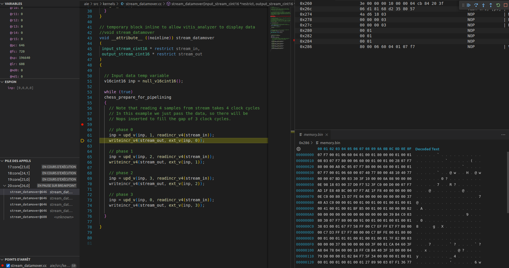

# Debug

Native VSCode debugger. Supports Xilinx's XSDB / XSCT.
Shamelessly inspired by webfreak's debug extension.

This allow to use VSCode instead of the horrible and hacky VITIS software to develop and debug on Xilinx's CPU.

## Installation

Press ctrl-p (cmd+p on OS X) and run `ext install X-Ryl669.xsdb-debug` in visual studio code and install Xilinx's XSDB (via Vitis). See `Usage` for details on how to set it up.

## Usage

Or if you already have an existing debugger in your project setup you can click "Create Configuration" or use the auto completion instead:

Open your project and click the debug button in your sidebar. At the top right press
the little gear icon and select XSDB. It will automatically generate the configuration
you need.

Please focus on the `xsdb_target_filter` argument used to select the CPU to debug in XSDB/XSCT world.
This extension is able to debug multiple targets (CPU) of the same architecture which would appear as multiple thread in VSCode.

The argument `symbol_mapper` can be used to specify an `addr2line` compliant software to map from address to symbols.
Since you can debug any target with XSCT/XSDB debugger, this includes architectures that aren't documented or tooled by AMD/Xilinx.
Typically, Xilinx Versal's AI Engine are CPU without a documented architecture, nor any tools. The Xilinx provided's compiler will output
an incomplete ELF file for such target with no architecture described in it. Yet, these ELF files do have debug information 
that can be used with usual `addr2line` tool to map basic address to function and file+line.

XSDB/XSCT protocol doesn't support getting symbol from address, nor does it support getting address from symbol for all symbols.

Use `autorun` to send TCL initialization commands to discover new targets (like AI Engine's cores). In order to capture those commands, 
you'll like need to run VITIS software at least once to display its XSCT console and copy and paste the initialisation commands.

### Attaching to existing processes

This debugger works only by attaching to an HW server. It does so by launching an XSDB instance and then 
asking it to connect to any HW server. You can not start or stop a software with this debugger (the `dow` command is not supported).
This means that your system must be autonomous and start by its own. The debugger can pause and resume the software on the target.

